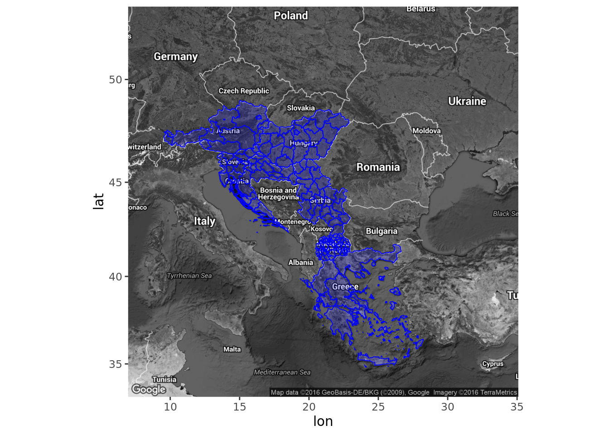
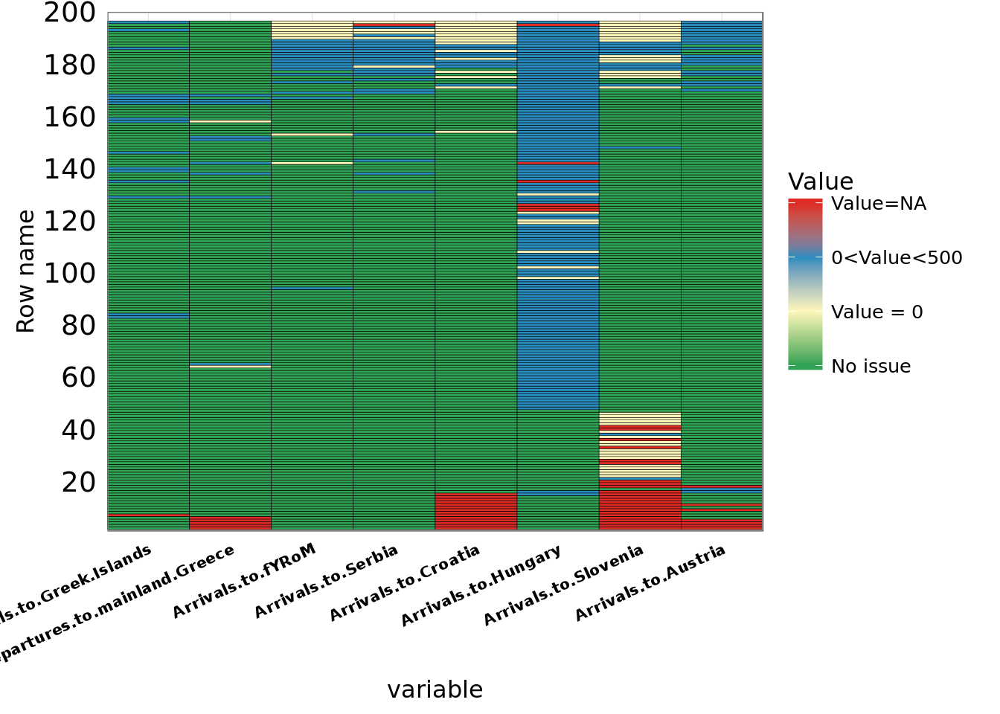

```{r knitr_init, echo=FALSE, cache=FALSE}
library(knitr)
library(rmdformats)

## Global options
options(max.print="75")
opts_chunk$set(echo=FALSE,
	             cache=TRUE,
               prompt=FALSE,
               tidy=TRUE,
               comment=NA,
               message=FALSE,
               warning=FALSE)
opts_knit$set(width=75)
```

## 1. Introduction

In September 2015, the British Red Cross (BRC) developed a model to anticipate refugee flows in Europe.[^1] Such models are useful to aid organisations due to the insight they offer into the volume of refugees and the routes they travel. In turn, this allows for strategic planning of goods (e.g. foodstuffs, blankets and medicines) and volunteers to areas that are most likely to need them. 

The model created by the BRC is based on count data[^2] published by the United Nations High Commisioner for Refugees (UNHCR).[^3] The results were generally regarded as positive but found to be more stable for countries that are situated closer to the final destination of refugees.[^4] In this document, we perform several exploratory analyses aimed improving our understanding of the UNHCR data and improving the initial model created by the BRC. To this end, we first outline the problem statement and goals. Then we perform an exploratory data analysis of the UNHRC data. In turn, we construct several models aimed at outperforming the BRC model. We conclude with limitations and suggestions for follow-up projects.

## 2. Problem statement and project goals

The Leiden University Centre for Innovation (CFI) was asked to explore the UNHCR data and, if possible, improve on the original BRC model. Concretely, our goals were as follows:

1. Gain a better understanding of the count data. That is, try to better understand its limitations. 
2. Outperform the BRC model in prediction accuracy and robustness.
3. Find a way to predict refugee arrivals at least two days ahead.

This exploratory analysis is limited to the period between the September 1, 2015 and March 14, 2016. This means that recent events (e.g. EU-Turkey deal) are not reflected in our dataset. 

The exploratory data analysis for the UNHRC data is conducted on the entire dataset. For points 2 and 3 listed above, we decided to take one country (Austria) as a test case.

## 3. Exploratory Data Analysis

The data we use for our analysis comes straight from the UNHCR google spreadsheet (see footnote 2 below). Figure 1 below gives an overview of the countries represented in the dataset.

```{r}
# Prep ----
rm(list=ls())

# Load packages
library(dplyr)
# Load ggplot2
library(ggplot2)
# Load reshape
library(reshape2)
# Plotly
library(plotly)

# Load data
data <- tbl_df(read.csv("DA.csv",
                        stringsAsFactors = FALSE, na.strings="N/A"))
```



### 3.1 Data quality

Looking at figure 2 below, we observe several discrepancies:

1. The data is of varying quality between rows 0 and 50. 
2. The first four columns have almost no missing values, whereas the columns thereafter suggest varying data quality.
3. Hungary is an outlier in that almost no refugees pass through the country after row 50 or so. 



In general, these dynamics are not out of the ordinary. Hungary closed its borders around October (see below) and the `NA` values for Slovenia, Croatia and Austria are likely due to the fact that the UNHCR started counting refugees at a later point in time in these areas. 

### 3.2 Time-series trends

Looking at the time-series trends in Figure 3 below, we observe the following:

1. Especially the first three plots (Greek Islands, Macedonia (FYROM) and Serbia) seem to correlate highly with one another. This makes sense looking at the map above; the UNHCR data assumes that refugees take this path.
2. The drop in refugees for Hungary in October corresponds with [news reports](http://www.theguardian.com/world/2015/oct/17/hungary-closes-border-to-refugees-as-turkey-questions-eu-deal-to-stem-crisis) at that time.
4. The article linked to in point 3 also contains a sentence (see below) that indicates that the uptick in refugee arrivals in Slovenia is closely linked to the decrease in Hungary. 

<blockquote> "Earlier on Friday, <font color="#184369">Croatia said it would begin diverting refugees on its territory to Slovenia after Hungary announced it would close the border</font> – a key crossing point on the travellers’ route since Budapest sealed its frontier with Serbia in mid-September." </blockquote>

5. Despite this move by Croatia, we don't see a rapid decrease in refugees in Croatia.
6. In all countries, refugee arrivals follow the same, downwards trend.

```{r}
vals <- unlist(unname(sapply(names(data), function(x) if(grepl("Arrival", x)) return(x))))

# Melt data
data_melt <- melt(data[,c("Date",vals)], id="Date")

# Turn "Date" into date format
library(lubridate)
data_melt$Date <- as.Date(dmy(data_melt$Date))  
data_bind <- data_melt

# Plot
p <- ggplot() +
  geom_line(data=data_bind,
            aes(x=Date, y = value), color = "black") +
  theme_bw() +
  geom_smooth(data=data_bind,
              aes(x=Date, y=value), stat="smooth", method = "loess") +
  facet_wrap(~ variable, nrow = 3)
ggplotly(p)
```

### 3.3 Correlating arrivals between countries

The plots below are obtained as follows:

1. Take the refugee arrivals for two countries (say, Greece and Macedonia)
2. Define a vector of parameters by which to lag the refugee arrivals in Greece. The idea being that if, say, traveling to Macedonia takes 2 days, Greek refugee arrivals on e.g. Monday should highly correlate with refugee arrivals in Macedonia on Wednesday. Here, we lag from 0 days to 20 days.
3. Repeat point 2 for every row (that is, for every day between September 1st 2015 and February 16th 2016).
4. For each of these days, take the time lag for which the correlation is highest between the refugee arrivals in both countries.
5. Plot this for each row.

KNN imputation is used to correct for NA values (with `k == 4`). 

```{r, echo=FALSE, results = "hide"}
library(VIM) # for knn imputation
# Correlation at time t
coratTime <- function(data1, data2, t) {
  # Create df
  df <- data.frame(data1,
                   data2)
  # Impute missing values
  df <- kNN(df, k = 4)
  # Select columns
  df <- df[,c(1:2)]
  # Lag data2 by t
  df$data1lag <- lag(df$data1, n=t)
  # Filter by t to get an even amount of rows
  if(t > 0) {
    df <- df[-c(1:t),]
  }
  # Calculate correlation
  return(data.frame("t" = t,
             "cor" = cor(df$data2, df$data1lag)))
}

# Wrapper function to call coratTime for each row in the dataset
wrapper <- function(data1, data2, rowNumber, from_to) {
  # Country1 to country2
  CM <- lapply(0:20, function(x) {
    coratTime(data1[rowNumber:196], 
              data2[rowNumber:196], x)
  }) ; CMB <- do.call(rbind.data.frame, CM) ; CMB$from_to <- from_to
  return(CMB)
}

# For each row number, call correlation for next 20 days and return the day 't' on which correlation was highest.

# GREECE --> MACEDONIA
GM_t <- lapply(1:169, function(x) {
  # Call wrapper
  GM <- wrapper(data$Arrivals.to.Greek.Island,
              data$Arrivals.to.fYRoM,
              x,
              "GRE - MA")
  # If any NA, then not enough days to forecast and we should stop (this happens at row 170)
  if(any(is.na(GM$cor))){
    return(NULL)
  }
  # Return the highest value
  GM_highest <- GM[GM$cor == max(GM$cor),]
  # Add row name
  GM_highest$row <- x
  # Return
  return(GM_highest)
})
# Bind
GM_b <- do.call(rbind.data.frame, GM_t)

# GREECE --> SERBIA
GS_t <- lapply(1:169, function(x) {
  # Call wrapper
  GM <- wrapper(data$Arrivals.to.Greek.Island,
              data$Arrivals.to.Serbia,
              x,
              "GRE - SER")
  # If any NA, then not enough days to forecast and we should stop (this happens at row 170)
  if(any(is.na(GM$cor))){
    return(NULL)
  }
  # Return the highest value
  GM_highest <- GM[GM$cor == max(GM$cor),]
  # Add row name
  GM_highest$row <- x
  # Return
  return(GM_highest)
})
# Bind
GS_b <- do.call(rbind.data.frame, GS_t)

# GREECE --> CROATIA
GC_t <- lapply(1:169, function(x) {
  # Call wrapper
  GM <- wrapper(data$Arrivals.to.Greek.Island,
              data$Arrivals.to.Croatia,
              x,
              "GRE - CRO")
  # If any NA, then not enough days to forecast and we should stop (this happens at row 170)
  if(any(is.na(GM$cor))){
    return(NULL)
  }
  # Return the highest value
  GM_highest <- GM[GM$cor == max(GM$cor),]
  # Add row name
  GM_highest$row <- x
  # Return
  return(GM_highest)
})
# Bind
GC_b <- do.call(rbind.data.frame, GC_t)

# MACEDONIA --> SERBIA
MS_t <- lapply(1:169, function(x) {
  # Call wrapper
  GM <- wrapper(data$Arrivals.to.fYRoM,
              data$Arrivals.to.Serbia,
              x,
              "MAC - SER")
  # If any NA, then not enough days to forecast and we should stop (this happens at row 170)
  if(any(is.na(GM$cor))){
    return(NULL)
  }
  # Return the highest value
  GM_highest <- GM[GM$cor == max(GM$cor),]
  # Add row name
  GM_highest$row <- x
  # Return
  return(GM_highest)
})
# Bind
MS_b <- do.call(rbind.data.frame, MS_t)

# MACEDONIA --> CROATIA
MC_t <- lapply(1:169, function(x) {
  # Call wrapper
  GM <- wrapper(data$Arrivals.to.fYRoM,
              data$Arrivals.to.Croatia,
              x,
              "MAC - CRO")
  # If any NA, then not enough days to forecast and we should stop (this happens at row 170)
  if(any(is.na(GM$cor))){
    return(NULL)
  }
  # Return the highest value
  GM_highest <- GM[GM$cor == max(GM$cor),]
  # Add row name
  GM_highest$row <- x
  # Return
  return(GM_highest)
})
# Bind
MC_b <- do.call(rbind.data.frame, MC_t)

# SERBIA --> CROATIA
SC_t <- lapply(1:169, function(x) {
  # Call wrapper
  GM <- wrapper(data$Arrivals.to.Serbia,
              data$Arrivals.to.Croatia,
              x,
              "MAC - SER")
  # If any NA, then not enough days to forecast and we should stop (this happens at row 170)
  if(any(is.na(GM$cor))){
    return(NULL)
  }
  # Return the highest value
  GM_highest <- GM[GM$cor == max(GM$cor),]
  # Add row name
  GM_highest$row <- x
  # Return
  return(GM_highest)
})
# Bind
SC_b <- do.call(rbind.data.frame, SC_t)
# Plot correlation and best T for each row
GM_m<-melt(GM_b[,c(1:2,4)], "row")
GS_m<-melt(GS_b[,c(1:2,4)], "row")
GC_m<-melt(GC_b[,c(1:2,4)], "row")
MS_m<-melt(MS_b[,c(1:2,4)], "row")
MC_m<-melt(MC_b[,c(1:2,4)], "row")
SC_m<-melt(SC_b[,c(1:2,4)], "row")
```

These plots show several patterns:

1. For almost each country, the correlation becomes less strong after day 50. This indicates the occurence of one or multiple exogenous shocks (see points above).
2. The plot for greece - croatia is most volatile. This is not unexpected (look at the map above), because we don't have data between these countries.
3. Macedonia - serbia may be stable due to the transportation the Macedonian government made available to refugees passing through its territory.

```{r, echo=FALSE}
p <- ggplot(GM_m, aes(x=row, y=value)) +
  geom_line() +
  scale_x_continuous(breaks = seq(0,170,20)) +
  theme_bw() +
  facet_grid(variable ~ ., scales = "free_y") +
  ggtitle("Best t-value (lag) and correlation \nfor each day (GRE - MAC)")
ggplotly(p)
```

```{r, echo=FALSE}
p <- ggplot(GS_m, aes(x=row, y=value)) +
  geom_line() +
  scale_x_continuous(breaks = seq(0,170,20)) +
  theme_bw() +
  facet_grid(variable ~ ., scales = "free_y") +
  ggtitle("Best t-value (lag) and correlation \nfor each day (GRE - SER)")
ggplotly(p)
```

```{r, echo=FALSE}
p <- ggplot(GC_m, aes(x=row, y=value)) +
  geom_line() +
  scale_x_continuous(breaks = seq(0,170,20)) +
  theme_bw() +
  facet_grid(variable ~ ., scales = "free_y") +
  ggtitle("Best t-value (lag) and correlation \nfor each day (GRE - CRO)")
ggplotly(p)
```

```{r, echo=FALSE}
p <- ggplot(MS_m, aes(x=row, y=value)) +
  geom_line() +
  scale_x_continuous(breaks = seq(0,170,20)) +
  theme_bw() +
  facet_grid(variable ~ ., scales = "free_y") +
  ggtitle("Best t-value (lag) and correlation \nfor each day (MAC - SER)")
ggplotly(p)
```

```{r, echo=FALSE}
p <- ggplot(MC_m, aes(x=row, y=value)) +
  geom_line() +
  scale_x_continuous(breaks = seq(0,170,20)) +
  theme_bw() +
  facet_grid(variable ~ ., scales = "free_y") +
  ggtitle("Best t-value (lag) and correlation \nfor each day (MAC - CRO)")
ggplotly(p)
```

```{r, echo=FALSE}
p <- ggplot(SC_m, aes(x=row, y=value)) +
  geom_line() +
  scale_x_continuous(breaks = seq(0,170,20)) +
  theme_bw() +
  facet_grid(variable ~ ., scales = "free_y") +
  ggtitle("Best t-value (lag) and correlation \nfor each day (SER - CRO)")
ggplotly(p)
```

### 3.4 Regressing lagged arrivals in greece on arrivals in macedonia

To further check the robustness of the correlations above, we can define several linear models with different lags to see where/how they break down. This is done below for the relationship of refugee arrivals in Macedonia (dependent) and Greece (independent).

```{r, results = "hide"}
# How much of the variaation is explained by yesterday?
reg_data <- data.frame("arrivals_greece" = data$Arrivals.to.Greek.Islands,
                       "arrivals_macedonia" = data$Arrivals.to.fYRoM)
# Impute
rd <- kNN(reg_data)[,c(1:2)]
# Lag arrivals greece
rd$arrivals_greece_lag1 <- lag(rd$arrivals_greece, 1)
rd$arrivals_greece_lag2 <- lag(rd$arrivals_greece, 2)
rd$arrivals_greece_lag3 <- lag(rd$arrivals_greece, 3)
rd$arrivals_greece_lag4 <- lag(rd$arrivals_greece, 4)
rd$arrivals_greece_lag5 <- lag(rd$arrivals_greece, 5)
rd$arrivals_greece_lag6 <- lag(rd$arrivals_greece, 6)
```

```{r}
# Define multiplot function, taken from [here](http://www.cookbook-r.com/Graphs/Multiple_graphs_on_one_page_(ggplot2)/), such that we can plot 
# multiple graphs in one grid.

# Multiple plot function
#
# ggplot objects can be passed in ..., or to plotlist (as a list of ggplot objects)
# - cols:   Number of columns in layout
# - layout: A matrix specifying the layout. If present, 'cols' is ignored.
#
# If the layout is something like matrix(c(1,2,3,3), nrow=2, byrow=TRUE),
# then plot 1 will go in the upper left, 2 will go in the upper right, and
# 3 will go all the way across the bottom.
#
multiplot <- function(..., plotlist=NULL, file, cols=1, layout=NULL) {
  library(grid)

  # Make a list from the ... arguments and plotlist
  plots <- c(list(...), plotlist)

  numPlots = length(plots)

  # If layout is NULL, then use 'cols' to determine layout
  if (is.null(layout)) {
    # Make the panel
    # ncol: Number of columns of plots
    # nrow: Number of rows needed, calculated from # of cols
    layout <- matrix(seq(1, cols * ceiling(numPlots/cols)),
                    ncol = cols, nrow = ceiling(numPlots/cols))
  }

 if (numPlots==1) {
    print(plots[[1]])

  } else {
    # Set up the page
    grid.newpage()
    pushViewport(viewport(layout = grid.layout(nrow(layout), ncol(layout))))

    # Make each plot, in the correct location
    for (i in 1:numPlots) {
      # Get the i,j matrix positions of the regions that contain this subplot
      matchidx <- as.data.frame(which(layout == i, arr.ind = TRUE))

      print(plots[[i]], vp = viewport(layout.pos.row = matchidx$row,
                                      layout.pos.col = matchidx$col))
    }
  }
}
```

Eye-balling the plots below, it appears that the most stable relationship exists between a time lag of 4 days for Greek refugee arrivals and those of Macedonian refugee arrivals. This not entirely in line with the correlational plot above, where a lag of 3 days was found to be optimal for roughly 120 days.

```{r}
# Plot arrivals on greek islands agains arrivals in macedonia
library(ggplot2)
library(grid)
# Melt
rdm <- melt(rd, "arrivals_macedonia")

# Plot

# No time lag
p <- ggplot(rdm, aes(x=arrivals_macedonia, y=value, group=variable)) +
  geom_point() +
  theme_bw() +
    theme(axis.text.x = element_text(size=8,
                                   colour = "black"),
        axis.text.y = element_text(size=8,
                                   colour = "black"),
        axis.title.x = element_text(size = 10),
        axis.title.y = element_text(size = 10),
        plot.title = element_text(size = 11)) +
  geom_smooth(method = "lm", formula = y ~ poly(x, 1)) +
  facet_wrap(~variable)
ggplotly(p)
```

We can plot simple linear models for each of the relationships above and examine the residuals to gain a better understanding of the relationship. The model with a time lag of `t==4` indeed scores highest in terms of $R^2$ (roughly 0.54). The beta coefficients should be intepreted such that each additional refugee in greece (with appropriate time lag) leads to one additional refugee in Macedonia; e.g. for a time lag of 4 days, this means that for each additional refugee in Greece with lag 4, we expect .87 refugee to arrive in Macedonia.

```{r}
# 7 models with 1 predictor
lm1 <- lm(arrivals_macedonia ~ arrivals_greece, data=rd)
lm2 <- lm(arrivals_macedonia ~ arrivals_greece_lag1,
          data=rd[!is.na(rd$arrivals_greece_lag1),])
lm3 <- lm(arrivals_macedonia ~ arrivals_greece_lag2,
          data=rd[!is.na(rd$arrivals_greece_lag2),])
lm4 <- lm(arrivals_macedonia ~ arrivals_greece_lag3,
          data=rd[!is.na(rd$arrivals_greece_lag3),])
lm5 <- lm(arrivals_macedonia ~ arrivals_greece_lag4,
          data=rd[!is.na(rd$arrivals_greece_lag4),])
lm6 <- lm(arrivals_macedonia ~ arrivals_greece_lag5,
          data=rd[!is.na(rd$arrivals_greece_lag5),])
lm7 <- lm(arrivals_macedonia ~ arrivals_greece_lag6,
          data=rd[!is.na(rd$arrivals_greece_lag6),])
```

The residuals show that the RSS is minimized for a time lag of 4 days. However, all models show strong signs of [autocorrelation](https://en.wikipedia.org/wiki/Autocorrelation) and [heteroskedasticity](http://www.statsmakemecry.com/smmctheblog/confusing-stats-terms-explained-heteroscedasticity-heteroske.html). Given the nature of the data (i.e. time-series) and the lack of predictors, this is not unexpected.

```{r}
# Plot residuals
resPlot <- function(lm, lag) {
  residual_df <- data.frame("residuals" = resid(lm),
                            "fitted_values" = lm$fitted.values)
  return(ggplot(residual_df, aes(x=fitted_values, y=residuals)) +
    geom_point() +
    geom_smooth() +
    theme_bw() +
    theme(axis.text.x = element_text(size=8,
                                   colour = "black"),
        axis.text.y = element_text(size=8,
                                   colour = "black"),
        axis.title.x = element_text(size = 10),
        axis.title.y = element_text(size = 10),
        plot.title = element_text(size = 11)) +
    ggtitle(paste0("Model with lag=",lag)))
}
multiplot(resPlot(lm1, 0), resPlot(lm2,1), resPlot(lm3,2), resPlot(lm4,3),
          resPlot(lm5,4), resPlot(lm6,5), resPlot(lm7,6), cols =3)
```

### 3.5 Conclusion

The UNHCR data shows interesting patterns with respect to refugee flows between countries. One obvious drawback of this data is that it pertains to counts of refugees only, and that it is therefore quite limiting in terms of its ability to take into account large exogenous shocks (e.g. closing of borders). Nonetheless, the exploratory analyses show that there is some merit to the approach of lagging refugee arrivals such that we can follow their movements across countries. In the next section, we will follow this approach to predict refugee arrivals in Austria.

## 4 Predicting refugee arrivals in Austria

In this section, we will evaluate the performance of several models in predicting refugees in Austria. The first paragraph outlines the data used for this exercise and describes the pre-processing steps we take to prepare the data for modeling. Then, we will look at the model created by Simon Johnson for the BRC. We then evaluate our own model.

### 4.1 Data, pre-processing and evaluation metrics

We use a specific subset of the UNHRC data for our model which is engineered to follow Simon Johnson's pre-processing steps as accurately as possible.[^5] The time period of this data runs from 2015-10-20 to 2016-02-18. The period until 2015-01-01 is used to train our models. The remaining data is used for the purpose of evaluation. 

To pre-process the data, we take refugee arrivals in Austria as the dependent (i.e. outcome) variable. The independent variable (i.e. features) consist of refugee arrivals in all other countries, lagged by one to seven days. As such, each country is represented seven times in our dataset. Table 1 below shows the schematic outline of this data.[^6]

```{r}
headers <- c("Arrivals_Austria_today", "Arrivals_greece_lag1", "Arrivals_greece_lag2", "...", "Arrivals_greece_lag7", "Arrivals_Macedonia_lag1", "etc.")
values1 <- c("500", "250","150", "...", "700", "425", "...") 
values2 <- c("700", "550", "250", "...", "890", "300", "...")
df <- do.call(rbind.data.frame, list(values1,values2))
names(df) <- headers
knitr::kable(df)
```

All analyses are performed using the R statistical language. We use the `caret` package in R to train our models.[^7] We use Leave-One-Out Cross-Validation (LOOCV) as our cross-validation technique. The results for all models are presented in a Shiny application which is available [here](http://tinyurl.com/z9fmh7b). In this document, we only report on the model that we regard as being the best fit. 

We use both the absolute error and the Root-Mean Square Error (RMSE) as evaluation metrics for our models.

### The BRC model

A lasso model is essentially a OLS linear regression model where the RSS is constrained according to some budget determined by a tuning parameter $\lambda$, which is estimated using cross-validation.[^8] This causes some features to shrink almost or completely to 0. As such, the Lasso performs feature selection.

The figure below shows the actual refugee count in Austria versus the predicted refugee count when predicting one day ahead. The absolute error for this model is `14865` and the RMSE is `536`.

```{r}
load("lasso1.Rdata")
d1 <- model$predict_1day
plot_ly(d1$plot_prediction_actual)
```

Despite being a linear model, the Lasso performs relatively well on our test data. There are several days on which the model strongly over - or under - predicts the number of refugees. Moreover, it mostly is one day off in picking up on sharp inclines and declines. 

While the model does not perform significantly worse in terms of absolute error and RMSE for a two-day prediction (absolute error `14197` and RMSE `522`), its predictions are more erratic. 

```{r}
d2 <- model$predict_2days
plot_ly(d2$plot_prediction_actual)
```

### Our model

Our final model is a Boosted General Additive Model (GAM).[^9] Like the Lasso, it performs variable selection. However, it is non-linear and thus better able to follow the uncertainty related to refugee inflows (although this reduction in bias may also lead to an increase in variance).

The figure below shows the results for a one-day prediction. The absolute error of this model is `11537` and the RMSE is `417`. As we can observe, the model quite accurately follows sharp increases and decreases of the data.

```{r}
load("gb.Rdata")
d1 <- model$predict_1day
plot_ly(d1$plot_prediction_actual)
```

Like the original Lasso Model, the boosted GAM model becomes more erratic when trying to predict more than one day ahead. Nonetheless, the model performs quite well (absolute error `11939` and RMSE `428`), and is relatively good at following rapid inclines and declines in refugee flows.

```{r}
d2 <- model$predict_2day
plot_ly(d2$plot_prediction_actual)
```

## 5. Limitations, recommendations and conclusions.

The preceding paragraphs show that the BRC model can be improved by using a boosted non-linear model. However, the model has only been evaluated over one test period for one country. Additional testing should focus on testing the model on different time periods for different countries. Moreover, additional testing is needed to determine the appropriate 'time window' for the model (that is, the number of days used for prediction), and to determine how often the model should be retrained in order to incorporate new events.

In its current form, this model is not robust enough to base policy on. From a substantive point of view, we need more information about the direct needs of aid organisations and some measure of an acceptable error. This will mitigate situations in which there is an overabundance of supplies (bad, but not devastating) and an underabundance of supplies (potentially disastrous). 

Additionally, we believe that dashboards that incorporate such models would benefit greatly by incorporating manual triggers to simulate e.g. closed border crossings. This allows for scenario analysis on the part of aid organisations. Combined with ancillary data such as weather forecasts, geographical information, natural landscape relief, political sentiment, and news, such dashboards can provide aid organisations with a powerful tool.

## References

[^1]: For more information, see the [GitHub repository](https://github.com/SimonbJohnson/europe-15-situational-awareness) and the corresponding [dashboard](https://medium.com/@Simon_B_Johnson/predicting-migration-flow-through-europe-3b93b0482fcd#.x5enjwevs).
[^2]: A copy of the data can be found [here](https://docs.google.com/spreadsheets/d/15OC8U1lodClWj0LQ3dUi3sR1emtZxQx5ZDOIPZFgwgM/edit#gid=0)
[^3]: See the [UNHCR website](http://data.unhcr.org/mediterranean/regional.php) for more information
[^4]: For more information, see [this article](https://medium.com/@Simon_B_Johnson/predicting-migration-flow-through-europe-3b93b0482fcd#.x5enjwevs) written by Simon Johnson of the BRC.
[^5]: See Simon Johnson's [GitHub repository](https://github.com/SimonbJohnson/europe-15-situational-awareness) for the original pre-processing steps.
[^6]: A copy of our dataset can be downloaded [here](https://drive.google.com/file/d/0BwFSCwDYNUS9RE9mVEhlQmp2LUE/view?usp=sharing)
[^7]: A copy of the R script used to train our models can be downloaded [here](https://drive.google.com/file/d/0BwFSCwDYNUS9aFdNSlZxVFhaajQ/view?usp=sharing)
[^8]: See 'introduction to statistical learning', esp. pp 219-228
[^9]: See 'elements of statistical learning', esp. pp 295-304

```{r bib, include=FALSE}
# KEEP THIS AT THE END OF THE DOCUMENT TO GENERATE A LOCAL bib FILE FOR PKGS USED
knitr::write_bib(sub("^package:", "", grep("package", search(), value=TRUE)), file='skeleton.bib')
```
